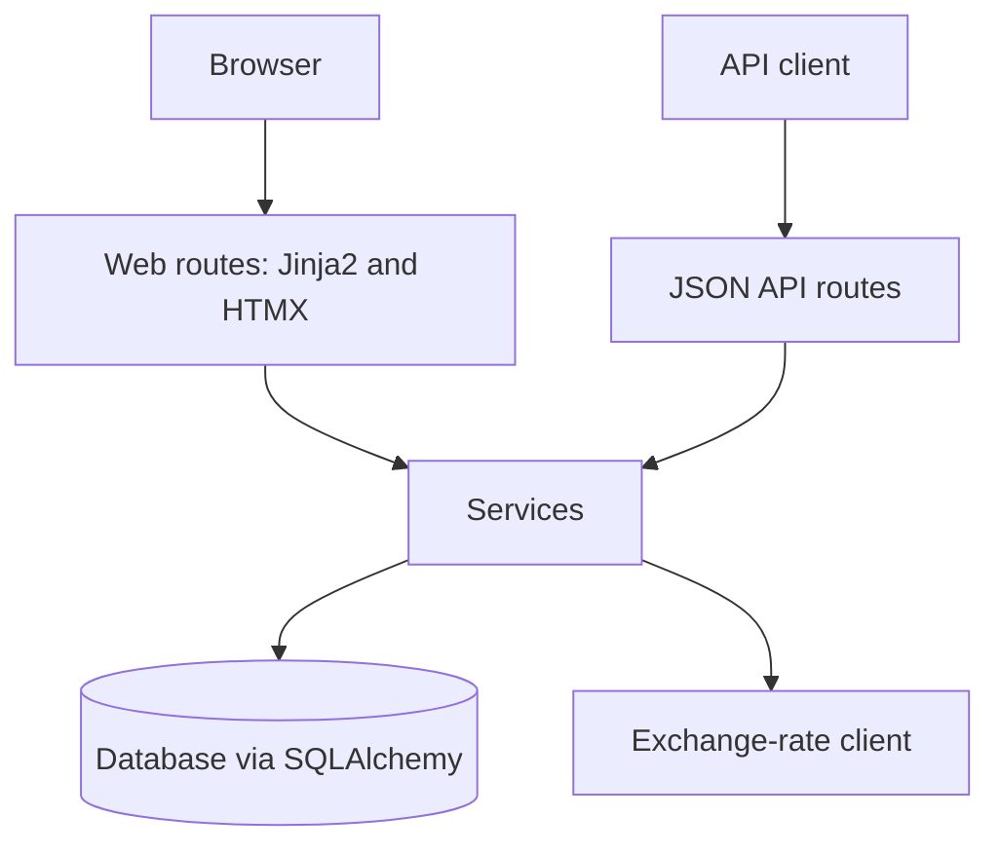

# Architecture

Use this document to locate code and understand boundaries and design decisions.
For operation-level behavior, read [Service contracts](SERVICE_LAYER.md).
Return to the [documentation index](../README.md#documentation).

- [Code map](#code-map)
- [Layers and runtime](#layers-and-runtime)
- [Domain model](#domain-model)
- [Access model](#access-model)
- [Design decisions](#design-decisions)

## Code map

This is the canonical map of the main directories, not a generated file inventory.

| Path | Responsibility |
|------|----------------|
| [app/main.py](../app/main.py) | App creation, lifespan, router registration, static files and health |
| [app/config.py](../app/config.py) | Pydantic Settings; environment and `.env` configuration |
| [app/database.py](../app/database.py) | Engine, session factory and SQLite startup bootstrap |
| [app/api/v1/](../app/api/v1/) | JSON routes, input/output schemas and HTTP error mapping |
| [app/web/](../app/web/) | Cookie-authenticated HTML routes and HTMX responses |
| [app/core/](../app/core/) | JWT/password helpers and authentication dependencies |
| [app/services/](../app/services/) | Business operations and database access |
| [app/models/](../app/models/) | SQLAlchemy tables, relationships and constraints |
| [app/schemas/](../app/schemas/) | Pydantic input and response contracts |
| [app/utils/](../app/utils/) | Parsing, matching and canonicalization helpers |
| [app/templates/](../app/templates/) | Jinja pages, shared `partials/` and `macros/` |
| [app/static/](../app/static/) | Static assets |
| [alembic/](../alembic/) | Migration environment and versioned schema changes |
| [tests/](../tests/) | Executable parser, transaction service, HTML and API checks |
| [scripts/](../scripts/) | Administrative utilities, including manual user creation |
| `data/uploads/` | Private uploaded files; contents are git-ignored |
| [docs/](.) | Architecture, service contracts and operational procedures |

Runtime dependencies live in [requirements.txt](../requirements.txt); development
additions are in [requirements-dev.txt](../requirements-dev.txt). Container runtime
configuration lives in [Dockerfile](../Dockerfile) and
[docker-compose.yml](../docker-compose.yml).

## Layers and runtime

```mermaid
flowchart TD
    Browser[Browser] --> Web[Web routes: Jinja2 and HTMX]
    Client[API client] --> API[JSON API routes]
    Web --> Services[Services]
    API --> Services
    Services --> DB[(Database via SQLAlchemy)]
    Services --> FX[Exchange-rate client]
```

Routes own HTTP validation, authentication dependencies, response serialization
and error mapping. Services own business operations; models define persistence.
Templates render supplied data and must not perform database queries.

`get_db()` supplies and closes an `AsyncSession` per request. Existing write
services usually commit themselves; the dependency does not commit on behalf of
routes. See [transaction ownership](SERVICE_LAYER.md#transactions-and-errors)
before composing services into a larger operation.

Startup calls `init_db()`, which runs `create_all()` for SQLite only. PostgreSQL
requires Alembic. Startup bootstrap does not track or upgrade an existing schema;
see [Migrations](MIGRATIONS.md). Shutdown closes the shared exchange-rate HTTP client.

The browser UI uses CDN dependencies declared in
[base.html](../app/templates/base.html): HTMX 1.9, Tailwind 4 and DaisyUI 5.
There is no npm build. Web login returns an HTMX redirect and sets a JWT cookie;
API login returns a bearer token. Both use the same authentication services.
Transaction forms work with ordinary GET/POST; HTMX adds filtering, pagination and
linked-observation updates. Full GETs return pages, and fragment requests return their specific
partial. Filters and pages live in URLs; transaction-list return URLs are validated
against a local path and allowed query parameters. Screen behavior is documented
in [Transactions UI](ui/TRANSACTIONS.md).

## Domain model

- An **Account** groups **Cards**; a **Transaction** belongs to a card.
- A **SourcePayload** stores the immutable text or private file received by the
  application, its independent kind/media/ingestion dimensions and processing state.
- A **TransactionObservation** is one financial assertion extracted from a payload.
  A payload can produce zero or many observations; item keys are unique per payload.
- **TransactionSourceLink** connects an observation to at most one canonical
  transaction. A transaction can be supported by many observations.
- **BankStatementDetail** stores statement-wide metadata separately from its rows.
- **User** stores login identity. It currently has no ownership relationship to
  accounts or transactions.

Models are the source for current fields and relationships; revisions in
[alembic/versions/](../alembic/versions/) define how deployed schemas evolve.
Do not maintain another column list or revision history here.

## Access model

Protected JSON routes validate an active bearer-token user; web pages validate
the JWT cookie. Current transaction-domain services do not filter records by user
or family. Treat the installation as a shared dataset, not isolated personal budgets.

Registration is controlled by `REGISTRATION_ENABLED` in API/web routes. The example
`.env` disables it; the code default without that setting is enabled. The administrative
creation script calls the user service directly and does not use that switch.

Cookie login uses HttpOnly and SameSite=Lax; Secure depends on the request scheme.
Transaction pages, fragments and mutations require an active cookie user.
The cookie JWT has a sliding inactivity deadline configured by
`ACCESS_TOKEN_EXPIRE_MINUTES`. Authenticated web requests renew it, and protected
pages report recent visible-tab keyboard, pointer, touch and scroll activity through
a throttled same-origin endpoint. An idle or hidden page sends no heartbeat. Tokens
renewed during one login retain a signed session ID so existing forms remain valid.
Every transaction create/edit/delete/unlink POST validates a server-generated CSRF
token bound to that login session; an HTMX header alone grants no access. Other cookie
flows do not inherit this CSRF check automatically. Expired HTMX sessions use a full
login redirect. These controls preserve the shared dataset; they do not add ownership.
Transaction routes reject an explicit cross-origin `Origin` header, including on
reads, so the existing JSON API CORS policy cannot expose cookie HTML or CSRF tokens.

The read-only Dashboard summarizes the shared dataset through one service operation.
The JSON representation at `GET /api/v1/dashboard` requires an active bearer-token
user; the HTML page requires an active cookie user. Dashboard responses use
`private, no-store`; JSON varies by authorization, while HTML varies by cookie and
disables HTMX history storage. It adds no ownership rule or mutation.

Transaction responses and errors use `private, no-store` and
vary by cookie/HTMX request headers. Transaction pages disable HTMX history caching
and do not persist bank data in localStorage; Back/Forward re-fetches the URL.
Uploaded files are internal parser inputs: neither JSON nor HTML routes expose their
paths or contents, and they are not public static assets.

## Design decisions

| Decision | Reason and consequence |
|----------|------------------------|
| Shared services for HTML and JSON | Avoid separate business logic for each interface. Route-specific HTTP behavior stays at the boundary. |
| Server-rendered UI with HTMX | Supports forms and fragments without a SPA build. A future client can use the JSON API, but is not part of the current implementation. |
| Payloads, observations and transactions are separate | Preserve immutable evidence, repeated parser output and multiple independent observations without conflating canonical values. |
| SQLite locally, PostgreSQL in Docker | Supports lightweight development and the deployed database. Migration behavior must be checked on both backends. |

Current feature scope and future work are listed once in the [README](../README.md).
