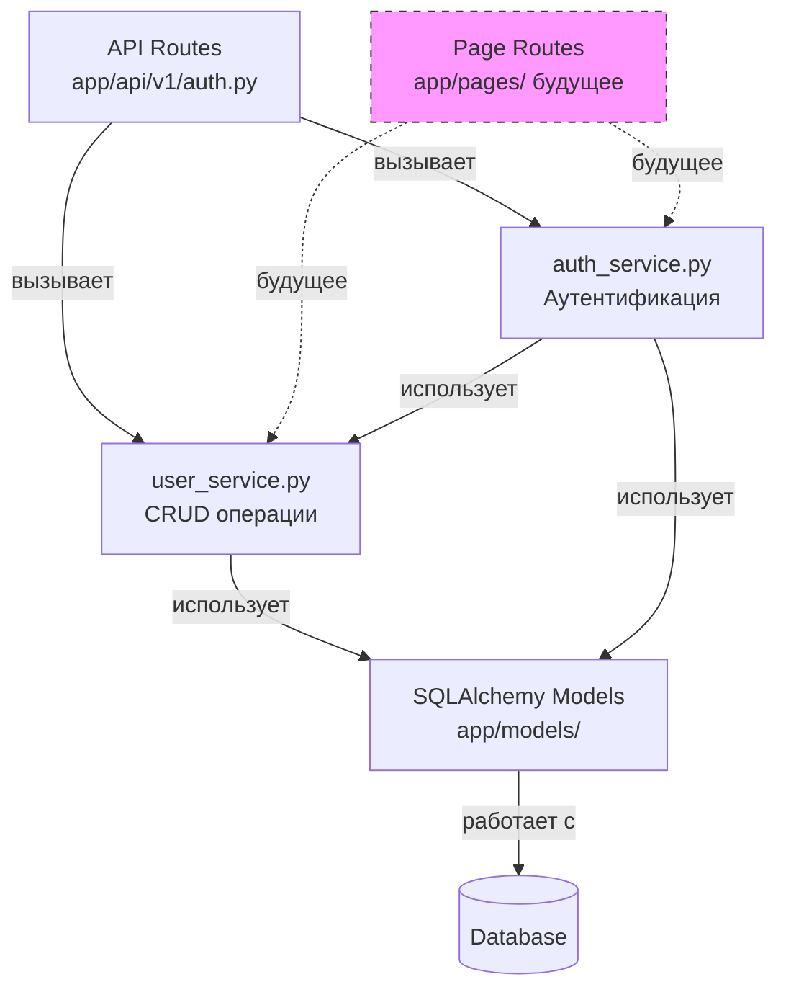

# Сервисный слой (Service Layer)

## Что такое сервисный слой?

Сервисный слой — это промежуточный слой между API роутами и моделями базы данных, который содержит всю бизнес-логику приложения.

## Зачем нужен сервисный слой?

### Проблема без сервисного слоя

До рефакторинга вся логика была в API роутах:

```python
# app/api/v1/auth.py (старая версия)
@router.post("/register")
async def register(user_in: UserCreate, db: AsyncSession):
    # Проверка email - 5 строк
    result = await db.execute(select(User).where(User.email == user_in.email))
    if result.scalar_one_or_none():
        raise HTTPException(status_code=400, detail="Email already registered")
    
    # Проверка username - 5 строк
    result = await db.execute(select(User).where(User.username == user_in.username))
    if result.scalar_one_or_none():
        raise HTTPException(status_code=400, detail="Username already taken")
    
    # Создание пользователя - 10 строк
    db_user = User(
        email=user_in.email,
        username=user_in.username,
        hashed_password=get_password_hash(user_in.password),
        ...
    )
    db.add(db_user)
    await db.commit()
    await db.refresh(db_user)
    return db_user
```

**Проблемы:**
- ❌ Дублирование кода при добавлении страничных роутов (Jinja2+HTMX)
- ❌ Сложно тестировать (нужно имитировать HTTP запросы)
- ❌ Бизнес-логика смешана с HTTP логикой
- ❌ Невозможно переиспользовать логику

### Решение: сервисный слой

```python
# app/services/user_service.py (новая версия)
async def create_user(user_in: UserCreate, db: AsyncSession) -> User:
    """Вся бизнес-логика создания пользователя"""
    if await get_user_by_email(user_in.email, db):
        raise ValueError("Email already registered")
    
    if await get_user_by_username(user_in.username, db):
        raise ValueError("Username already taken")
    
    db_user = User(
        email=user_in.email,
        username=user_in.username,
        hashed_password=get_password_hash(user_in.password),
        ...
    )
    db.add(db_user)
    await db.commit()
    await db.refresh(db_user)
    return db_user
```

```python
# app/api/v1/auth.py (новая версия)
@router.post("/register")
async def register(user_in: UserCreate, db: AsyncSession):
    """Только HTTP логика"""
    try:
        user = await user_service.create_user(user_in, db)
        return user
    except ValueError as e:
        raise HTTPException(status_code=400, detail=str(e))
```

**Преимущества:**
- ✅ Один код для API (JSON) и страниц (HTML)
- ✅ Легко тестировать без HTTP
- ✅ Чистое разделение ответственности
- ✅ Переиспользование логики

## Архитектура



## Структура сервисного слоя

```
app/services/
├── __init__.py           # Экспорт всех функций
├── user_service.py       # CRUD операции с пользователями
└── auth_service.py       # Аутентификация и токены
```

### app/services/__init__.py

Экспортирует все функции для удобного импорта:

```python
from app.services.user_service import (
    get_user_by_id,
    get_user_by_email,
    get_user_by_username,
    get_user_by_username_or_email,
    create_user,
    update_user,
)
from app.services.auth_service import (
    authenticate_user,
    create_user_access_token,
)
```

**Использование:**
```python
from app.services import user_service, auth_service

# Вместо:
# from app.services.user_service import create_user
# Можно:
user = await user_service.create_user(...)
```

## Функции сервисов

### user_service.py - Работа с пользователями

#### `get_user_by_id(user_id: int, db: AsyncSession) -> User | None`
Получить пользователя по ID.

```python
user = await user_service.get_user_by_id(123, db)
if user:
    print(f"Найден: {user.username}")
```

#### `get_user_by_email(email: str, db: AsyncSession) -> User | None`
Получить пользователя по email.

```python
user = await user_service.get_user_by_email("test@example.com", db)
```

#### `get_user_by_username(username: str, db: AsyncSession) -> User | None`
Получить пользователя по username.

```python
user = await user_service.get_user_by_username("johndoe", db)
```

#### `get_user_by_username_or_email(identifier: str, db: AsyncSession) -> User | None`
Гибкий поиск по username ИЛИ email. Полезно для входа.

```python
# Работает с любым из вариантов
user = await user_service.get_user_by_username_or_email("johndoe", db)
user = await user_service.get_user_by_username_or_email("john@example.com", db)
```

#### `create_user(user_in: UserCreate, db: AsyncSession) -> User`
Создать нового пользователя с полной валидацией.

**Валидация:**
- ✅ Проверка уникальности email
- ✅ Проверка уникальности username
- ✅ Автоматическое хеширование пароля
- ✅ Сохранение в БД

**Исключения:**
- `ValueError("Email already registered")` - email уже используется
- `ValueError("Username already taken")` - username уже используется

```python
try:
    user = await user_service.create_user(user_in, db)
    print(f"Создан пользователь: {user.id}")
except ValueError as e:
    print(f"Ошибка: {e}")
```

#### `update_user(user_id: int, user_update: UserUpdate, db: AsyncSession) -> User`
Обновить существующего пользователя.

**Валидация:**
- ✅ Проверка существования пользователя
- ✅ Проверка уникальности email (если меняется)
- ✅ Проверка уникальности username (если меняется)
- ✅ Автоматическое хеширование пароля (если меняется)

**Исключения:**
- `ValueError("User not found")` - пользователь не найден
- `ValueError("Email already registered")` - email уже используется
- `ValueError("Username already taken")` - username уже используется

```python
try:
    user = await user_service.update_user(123, user_update, db)
    print(f"Обновлен пользователь: {user.username}")
except ValueError as e:
    print(f"Ошибка: {e}")
```

### auth_service.py - Аутентификация

#### `authenticate_user(username_or_email: str, password: str, db: AsyncSession) -> User`
Аутентифицировать пользователя (проверка credentials).

**Проверки:**
- ✅ Поиск пользователя по username или email
- ✅ Проверка пароля (bcrypt)
- ✅ Проверка активности пользователя (is_active)

**Исключения:**
- `ValueError("Incorrect username or password")` - неверные учётные данные
- `ValueError("Inactive user")` - пользователь деактивирован

```python
try:
    user = await auth_service.authenticate_user("johndoe", "password123", db)
    print(f"Авторизован: {user.username}")
except ValueError as e:
    print(f"Ошибка входа: {e}")
```

#### `create_user_access_token(user: User) -> Token`
Создать JWT токен доступа для пользователя.

**Возвращает:** `Token` объект с полями:
- `access_token` - JWT токен
- `token_type` - всегда "bearer"

```python
user = await auth_service.authenticate_user("johndoe", "password123", db)
token = await auth_service.create_user_access_token(user)
print(f"Токен: {token.access_token}")
```

## Использование в API роутах

### Паттерн использования

```python
from app.services import user_service, auth_service

@router.post("/endpoint")
async def endpoint(data: Schema, db: AsyncSession):
    try:
        # Вызов сервиса
        result = await service_function(data, db)
        return result  # 200 OK
    except ValueError as e:
        # Преобразование бизнес-ошибки в HTTP ошибку
        raise HTTPException(status_code=400, detail=str(e))
```

### Пример: Регистрация

```python
@router.post("/register", response_model=UserSchema, status_code=201)
async def register(user_in: UserCreate, db: AsyncSession) -> User:
    try:
        user = await user_service.create_user(user_in, db)
        return user
    except ValueError as e:
        raise HTTPException(status_code=400, detail=str(e))
```

### Пример: Вход

```python
@router.post("/login", response_model=Token)
async def login(form_data: OAuth2PasswordRequestForm, db: AsyncSession) -> Token:
    try:
        user = await auth_service.authenticate_user(
            form_data.username, form_data.password, db
        )
        token = await auth_service.create_user_access_token(user)
        return token
    except ValueError as e:
        if "Inactive" in str(e):
            raise HTTPException(status_code=400, detail=str(e))
        else:
            raise HTTPException(
                status_code=401,
                detail=str(e),
                headers={"WWW-Authenticate": "Bearer"}
            )
```

## Использование в будущих страничных роутах

Когда добавим Jinja2+HTMX, используем те же сервисы:

```python
# app/pages/auth.py (будущее)
from fastapi import APIRouter, Request
from fastapi.templating import Jinja2Templates
from app.services import user_service

router = APIRouter()
templates = Jinja2Templates(directory="templates")

@router.post("/register")
async def register_page(
    request: Request,
    user_in: UserCreate,
    db: AsyncSession
):
    try:
        # Тот же сервис, что и в API!
        user = await user_service.create_user(user_in, db)
        return templates.TemplateResponse(
            "register_success.html",
            {"request": request, "user": user}
        )
    except ValueError as e:
        # HTML ответ вместо JSON
        return templates.TemplateResponse(
            "register.html",
            {"request": request, "error": str(e)},
            status_code=400
        )
```

## Правила работы с сервисным слоем

### ✅ Что должно быть в сервисах

- Бизнес-логика (валидация, проверки)
- Работа с базой данных (queries, commits)
- Работа с несколькими моделями
- Сложные вычисления
- Интеграция с внешними сервисами

### ❌ Что НЕ должно быть в сервисах

- HTTP специфичные вещи (HTTPException, status codes, headers)
- Зависимости от FastAPI
- Работа с request/response объектами
- Формирование JSON/HTML ответов

### Исключения

Сервисы **НЕ** используют `HTTPException`. Вместо этого:

```python
# ❌ Плохо - HTTP в сервисе
async def create_user(user_in: UserCreate, db: AsyncSession) -> User:
    if await get_user_by_email(user_in.email, db):
        raise HTTPException(status_code=400, detail="Email exists")

# ✅ Хорошо - доменные исключения
async def create_user(user_in: UserCreate, db: AsyncSession) -> User:
    if await get_user_by_email(user_in.email, db):
        raise ValueError("Email already registered")
```

Роуты преобразуют `ValueError` в нужный HTTP статус:
- `400 Bad Request` - для ошибок валидации
- `401 Unauthorized` - для ошибок авторизации
- `404 Not Found` - для ненайденных ресурсов

## Тестирование сервисов

Сервисы легко тестировать без HTTP слоя:

```python
# tests/test_user_service.py
import pytest
from app.services import user_service

@pytest.mark.asyncio
async def test_create_user(db_session):
    # Arrange
    user_data = UserCreate(
        email="test@example.com",
        username="testuser",
        password="password123"
    )
    
    # Act
    user = await user_service.create_user(user_data, db_session)
    
    # Assert
    assert user.id is not None
    assert user.email == "test@example.com"
    assert user.username == "testuser"

@pytest.mark.asyncio
async def test_create_user_duplicate_email(db_session):
    # Arrange
    user_data = UserCreate(
        email="test@example.com",
        username="testuser",
        password="password123"
    )
    await user_service.create_user(user_data, db_session)
    
    # Act & Assert
    user_data2 = UserCreate(
        email="test@example.com",  # Тот же email
        username="testuser2",
        password="password123"
    )
    with pytest.raises(ValueError, match="Email already registered"):
        await user_service.create_user(user_data2, db_session)
```

## Расширение сервисного слоя

При добавлении новых функций следуйте этой структуре:

### 1. Создайте новый сервис

```python
# app/services/transaction_service.py
from sqlalchemy.ext.asyncio import AsyncSession
from app.models.transaction import Transaction
from app.schemas.transaction import TransactionCreate

async def create_transaction(
    transaction_in: TransactionCreate,
    db: AsyncSession
) -> Transaction:
    """Создание новой транзакции"""
    # Валидация бизнес-правил
    # Работа с БД
    # Возврат результата
    pass

async def get_user_transactions(
    user_id: int,
    db: AsyncSession
) -> list[Transaction]:
    """Получение всех транзакций пользователя"""
    pass
```

### 2. Экспортируйте в __init__.py

```python
# app/services/__init__.py
from app.services.transaction_service import (
    create_transaction,
    get_user_transactions,
)
```

### 3. Используйте в роутах

```python
# app/api/v1/transactions.py
from app.services import transaction_service

@router.post("/transactions")
async def create_transaction_endpoint(
    transaction_in: TransactionCreate,
    db: AsyncSession
):
    try:
        transaction = await transaction_service.create_transaction(
            transaction_in, db
        )
        return transaction
    except ValueError as e:
        raise HTTPException(status_code=400, detail=str(e))
```

## Миграция существующего кода в сервисы

Если у вас есть бизнес-логика в роутах:

### Шаг 1: Выделите логику

```python
# Было в роуте:
@router.post("/complex-operation")
async def complex_operation(data: Schema, db: AsyncSession):
    # 50 строк логики
    result = await db.execute(...)
    if result:
        # ещё логика
    return something
```

### Шаг 2: Перенесите в сервис

```python
# app/services/my_service.py
async def perform_complex_operation(data: Schema, db: AsyncSession):
    # Те же 50 строк логики
    result = await db.execute(...)
    if result:
        # ещё логика
    return something
```

### Шаг 3: Используйте в роуте

```python
# Стало в роуте:
from app.services import my_service

@router.post("/complex-operation")
async def complex_operation(data: Schema, db: AsyncSession):
    try:
        result = await my_service.perform_complex_operation(data, db)
        return result
    except ValueError as e:
        raise HTTPException(status_code=400, detail=str(e))
```

## Заключение

Сервисный слой — это ключевой элемент масштабируемой архитектуры:

- 📦 **Инкапсуляция** - бизнес-логика в одном месте
- ♻️ **Переиспользование** - один код для разных клиентов
- 🧪 **Тестируемость** - простые unit-тесты
- 🔄 **Гибкость** - легко менять UI без изменения логики
- 📈 **Масштабируемость** - готовность к росту проекта

**Следующие шаги:**
1. ✅ Сервисный слой для User и Auth
2. 🔜 Добавить Jinja2+HTMX страницы
3. 🔜 Расширить сервисы для Transactions, Categories, Budgets
4. 🔜 Миграция на SPA (React/Vue)
