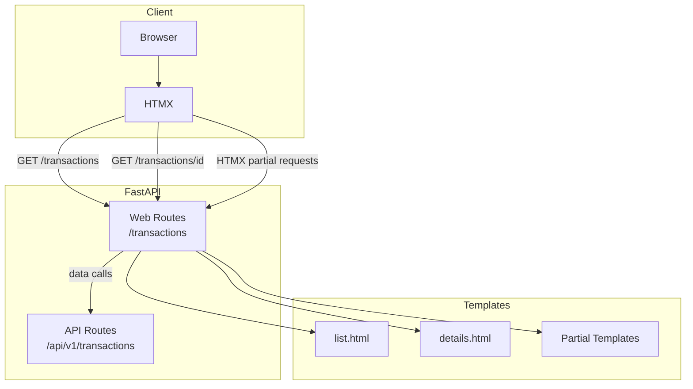
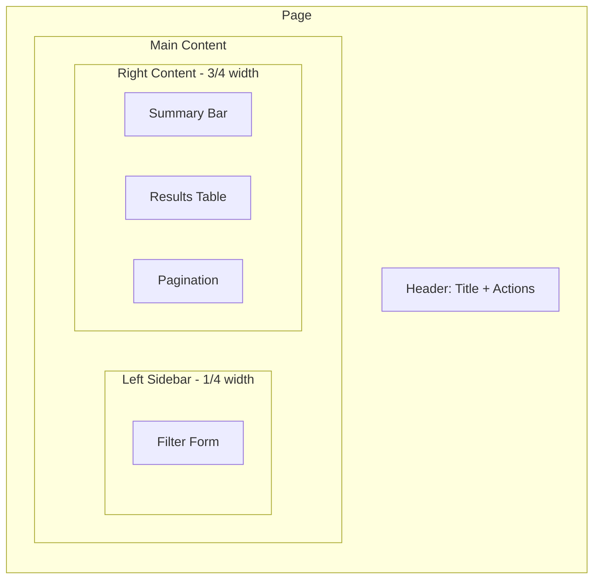
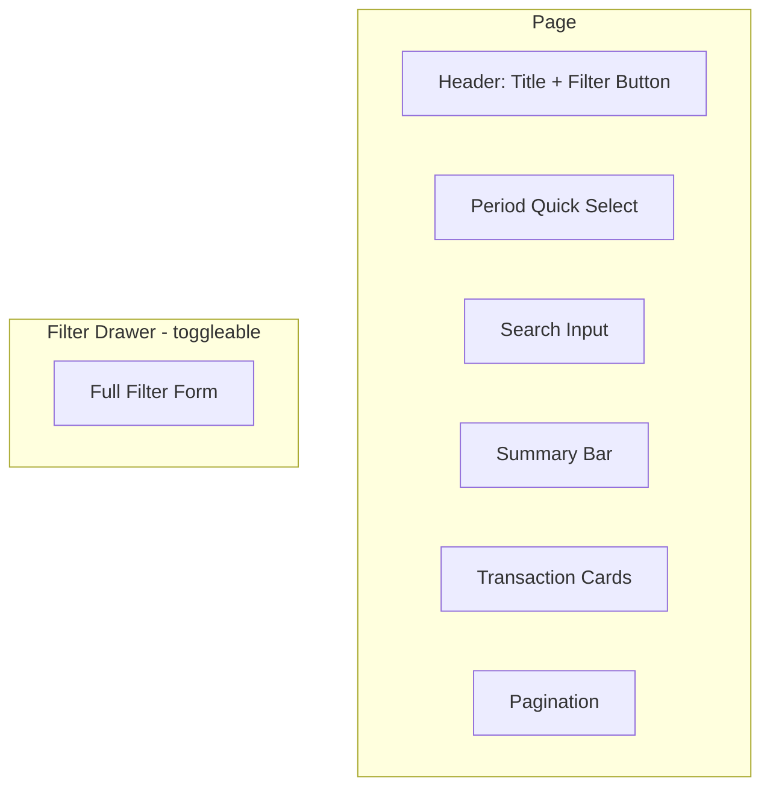
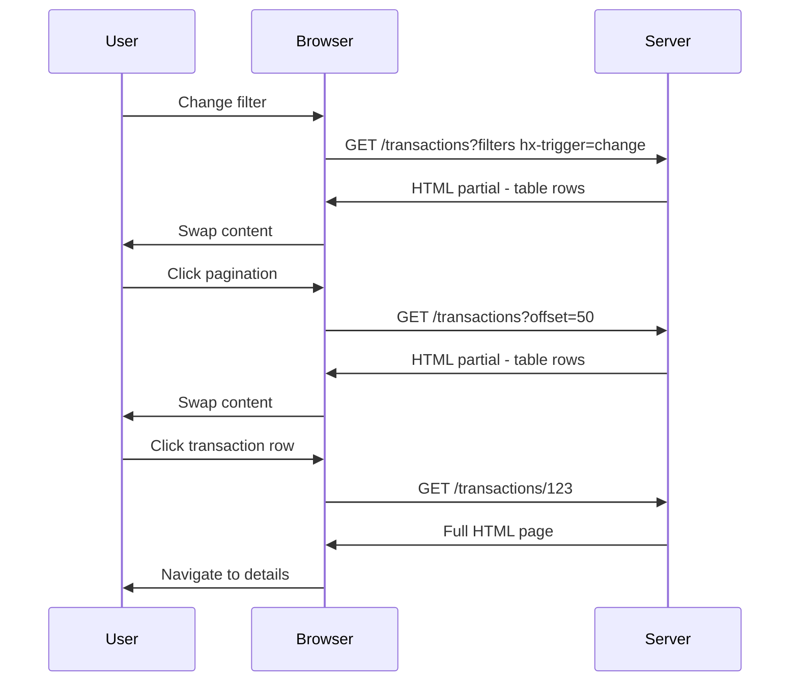
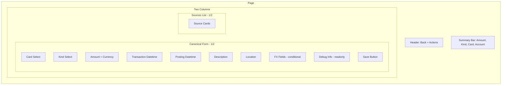
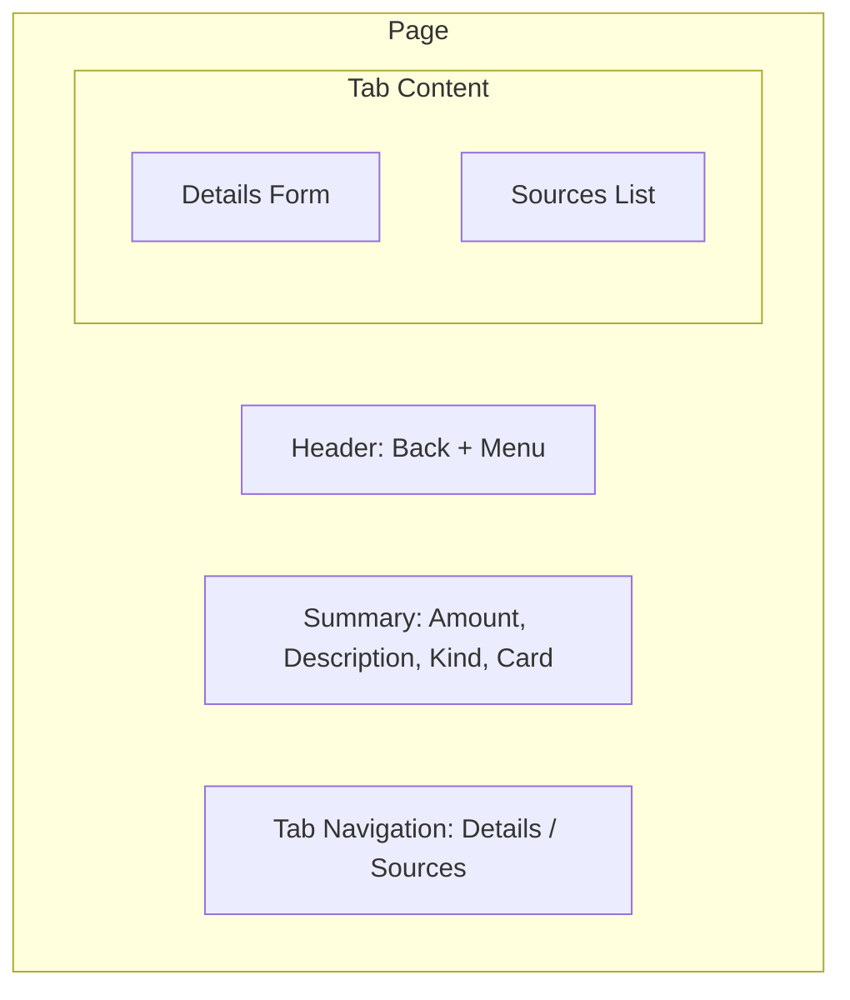
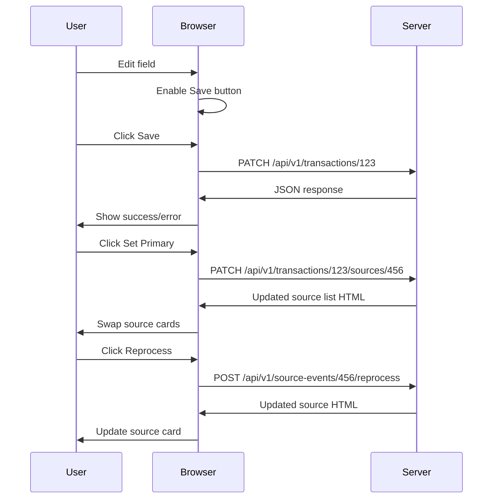

# Transactions UI Implementation Plan

## Overview

This plan details the implementation of two web UI screens for the Spendy MVP:
1. **Transactions list + filters** - A searchable, filterable list of transactions
2. **Transaction details** - Detailed view with source events

## Architecture Summary



## File Structure

```
app/
├── templates/
│   └── transactions/
│       ├── list.html              # Main list page with filters
│       ├── details.html           # Transaction details page
│       └── partials/
│           ├── _filters.html      # Filter form partial
│           ├── _filter_drawer.html # Mobile filter drawer
│           ├── _transaction_table.html # Desktop table rows
│           ├── _transaction_cards.html # Mobile card layout
│           ├── _transaction_row.html   # Single table row
│           ├── _transaction_card.html  # Single card
│           ├── _source_card.html       # Source event card
│           ├── _pagination.html        # Pagination controls
│           └── _summary.html           # Summary stats
├── web/
│   └── transactions.py            # Web routes for transactions
└── static/
    └── css/
        └── custom.css             # Minor additions if needed
```

## Screen 1: Transactions List

### Desktop Layout



### Mobile Layout



### Components

| Component | daisyUI Classes | Notes |
|-----------|-----------------|-------|
| Header buttons | `btn btn-primary btn-outline` | Add, Import actions |
| Filter container | `card` | Desktop sidebar |
| Filter drawer | `drawer` | Mobile slide-out |
| Account/Card selects | `select select-bordered w-full` | Dependent dropdowns |
| Period presets | `join` + `btn join-item` | Today/Week/Month/Custom |
| Date inputs | `input input-bordered` type=date | Custom range |
| Search input | `input input-bordered` type=search | Full-text search |
| Kind select | `select select-bordered` | Single select MVP |
| Direction radios | `radio` group | All/Out/In |
| Amount inputs | `input input-bordered validator` type=number step=0.01 | Min/max range |
| Results table | `table table-zebra` | Desktop only |
| Transaction cards | `card` | Mobile only |
| Badges | `badge` | Kind, currency, source count |
| Pagination | `join` + `btn` | HTMX-powered |
| Empty state | `alert alert-info` | No results |
| Error state | `alert alert-error` | API errors |

### Filter Fields

| Field | Type | API Param | Validation |
|-------|------|-----------|------------|
| account_id | select | account_id | Optional |
| card_id | select | card_id | Optional, depends on account |
| date_from | date | date_from | Optional |
| date_to | date | date_to | Optional, >= date_from |
| period_preset | buttons | - | Sets date_from/date_to |
| q | search | q | Optional, min 2 chars |
| kind | select | kind | Optional, enum |
| direction | radio | - | Maps to min_amount/max_amount sign |
| min_amount | number | min_amount | Optional, step=0.01 |
| max_amount | number | max_amount | Optional, step=0.01, >= min_amount |
| currency | select | - | Optional, filter by currency |

### HTMX Interactions



## Screen 2: Transaction Details

### Desktop Layout



### Mobile Layout



### Components

| Component | daisyUI Classes | Notes |
|-----------|-----------------|-------|
| Back button | `btn btn-ghost` | Navigate to list |
| Edit/Delete | `btn btn-primary btn-error` | Header actions |
| Mobile menu | `dropdown` | Action menu on mobile |
| Summary card | `card` | Quick overview |
| Form container | `card` | Desktop form |
| Card select | `select select-bordered validator` | Required |
| Kind select | `select select-bordered validator` | Required |
| Amount input | `input input-bordered validator` type=number step=0.01 | Required |
| Currency select | `select select-bordered validator` | Required |
| Datetime inputs | `input input-bordered` type=datetime-local | Optional |
| Description | `textarea textarea-bordered validator` | Required |
| Location | `input input-bordered` | Optional |
| FX toggle | `btn btn-sm` | Show/hide FX fields |
| FX inputs | `input input-bordered` type=number | Conditional |
| Debug info | `badge` + monospace | Read-only |
| Source cards | `card` | With expand/collapse |
| Source badges | `badge` | Type, status, primary |
| Tabs | `tabs` + `tab` | Mobile only |
| Modal | `modal` / `dialog` | Full raw text view |

### Form Fields

| Field | Type | API Field | Validation |
|-------|------|-----------|------------|
| card_id | select | card_id | Required |
| transaction_kind | select | transaction_kind | Required, enum |
| amount | number | amount | Required, step=0.01, non-zero |
| currency | select | currency | Required, 3 chars |
| transaction_datetime | datetime-local | transaction_datetime | Optional |
| posting_datetime | datetime-local | posting_datetime | Optional, >= transaction_datetime |
| description | textarea | description | Required, max length |
| location | text | location | Optional |
| original_amount | number | original_amount | Conditional with currency |
| original_currency | select | original_currency | Conditional with amount |
| fx_rate | number | fx_rate | Optional, step=0.000001 |
| fx_fee | number | fx_fee | Optional, step=0.01 |

### Source Card Structure

Each source card displays:
- Source type badge
- Parse status badge
- PRIMARY badge if is_primary=true
- Match confidence value
- Preview of raw_text or file_path
- Expandable parsed fields section
- Actions: Set primary, Reprocess, Unlink

### HTMX Interactions



## Canonicalization Rules Implementation

### Primary Date Display

```python
def get_primary_date(transaction):
    """Return the date to display in lists."""
    if transaction.posting_datetime:
        return transaction.posting_datetime
    if transaction.transaction_datetime:
        return transaction.transaction_datetime
    return transaction.created_at
```

### Date Type Badge

Show a badge indicating which date is being displayed:
- **P** = posting_datetime
- **T** = transaction_datetime  
- **C** = created_at fallback

### Source Count Badge

Display count of linked sources with visual indicator:
- 1 source: Normal badge
- 2+ sources: Highlighted badge indicates deduplication

## Validation Rules

### Client-Side (HTML5)

```html
<!-- Amount field -->
<input type="number" step="0.01" required 
       class="input input-bordered validator" />

<!-- Date range -->
<input type="date" name="date_from" />
<input type="date" name="date_to" 
       min="{date_from_value}" />

<!-- Currency -->
<select required class="select select-bordered validator">
  <option value="">Select currency</option>
  <option value="AED">AED</option>
  ...
</select>
```

### Server-Side Validation

| Rule | Fields | Error Message |
|------|--------|---------------|
| Required fields | card_id, amount, currency, description, kind | Field is required |
| Currency format | currency, original_currency | Must be 3 uppercase letters |
| Amount non-zero | amount | Amount cannot be zero |
| Date order | posting_datetime >= transaction_datetime | Posting date must be after transaction date |
| Amount range | max_amount >= min_amount | Max must be >= min |
| FX conditional | original_amount + original_currency | Both required if either provided |

## API Endpoints Used

| Endpoint | Method | Purpose |
|----------|--------|---------|
| `/api/v1/accounts` | GET | Populate account dropdown |
| `/api/v1/accounts/{id}/cards` | GET | Populate card dropdown |
| `/api/v1/transactions` | GET | List transactions with filters |
| `/api/v1/transactions/{id}` | GET | Get transaction details |
| `/api/v1/transactions/{id}` | PATCH | Update transaction |
| `/api/v1/transactions/{id}/sources` | GET | Get linked sources |
| `/api/v1/transactions/{id}/sources/{sid}` | PATCH | Update source link (set primary) |
| `/api/v1/source-events/{id}/reprocess` | POST | Reparse source |

## Web Routes to Implement

| Route | Template | HTMX Support |
|-------|----------|--------------|
| `GET /transactions` | list.html | Full page |
| `GET /transactions?partial=table` | _transaction_table.html | Table rows only |
| `GET /transactions?partial=cards` | _transaction_cards.html | Cards only |
| `GET /transactions?partial=filters` | _filters.html | Filter form |
| `GET /transactions/{id}` | details.html | Full page |
| `GET /transactions/{id}?partial=sources` | _source_card.html list | Sources list |

## Implementation Order

1. **Create base templates**
   - `list.html` - Main list page structure
   - `details.html` - Main details page structure

2. **Create filter partials**
   - `_filters.html` - Desktop filter form
   - `_filter_drawer.html` - Mobile filter drawer

3. **Create list partials**
   - `_transaction_table.html` - Desktop table
   - `_transaction_cards.html` - Mobile cards
   - `_transaction_row.html` - Single row
   - `_transaction_card.html` - Single card
   - `_pagination.html` - Pagination controls
   - `_summary.html` - Summary stats

4. **Create details partials**
   - `_source_card.html` - Source event card

5. **Implement web routes**
   - `app/web/transactions.py` - All web routes

6. **Update navigation**
   - Add Transactions link to navbar

7. **Add any necessary CSS**
   - Minimal additions to custom.css

## Responsive Breakpoints

Using Tailwind default breakpoints:
- **Mobile**: < 768px (md:) - Cards, drawer, tabs
- **Desktop**: >= 768px (md:) - Table, sidebar, two-column

## Accessibility Considerations

- Semantic HTML elements (table, form, nav, main)
- ARIA labels on interactive elements
- Focus management for drawer/modal
- Keyboard navigation support
- Screen reader announcements for HTMX updates
- Color contrast compliance via daisyUI themes

## Error Handling

| Scenario | UI Response |
|----------|-------------|
| No transactions | `alert alert-info` with message |
| API error | `alert alert-error` with details |
| Validation error | `validator-hint` messages |
| Network error | HTMX error handler, retry option |
| Loading state | HTMX indicator with spinner |

## Testing Checklist

- [ ] Desktop layout renders correctly
- [ ] Mobile layout renders correctly
- [ ] Filter form submits via HTMX
- [ ] Pagination works via HTMX
- [ ] Table/card partials render correctly
- [ ] Details form validation works
- [ ] Source cards expand/collapse
- [ ] Set primary action works
- [ ] FX fields show/hide correctly
- [ ] Date badges display correctly
- [ ] Source count badges display
- [ ] Empty state displays
- [ ] Error state displays
- [ ] Loading indicators show
